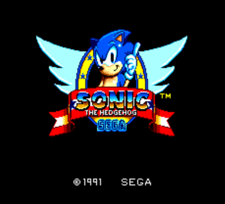

# Emscripten js-master-system Games

Play old Master System games on your browser

# Prerequires

1. Python

# Run

Clone

```
git clone https://github.com/humbertodias/emscripten-js-master-games.git
```

Into 

```
cd emscripten-js-master-games/
```

Server

```
python -m SimpleHTTPServer 9090
```

Open on your browser

```
open http://localhost:9090
```


# Output




# Tested Browsers

Browser | Performance |
------------- | -------------
Firefox | Fast
Chrome | Fast
Safari | Slow
Opera | Normal
IE | Didn't try


# References

1. Miracle

	[https://github.com/mattgodbolt/Miracle](https://github.com/mattgodbolt/Miracle)